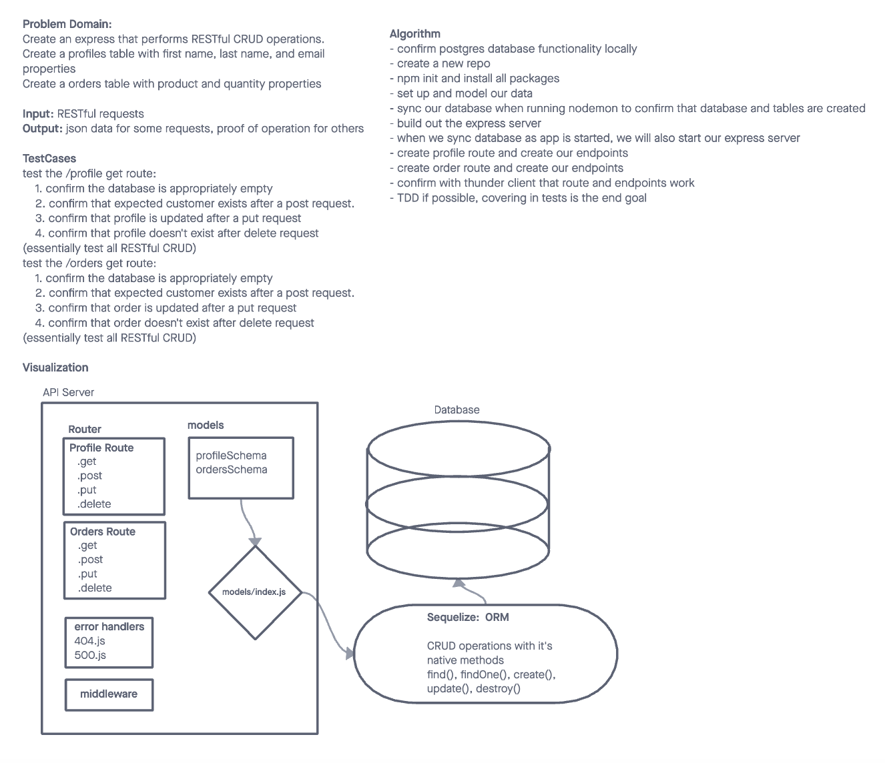

# LAB - Class 03

## Project: Express REST API / Data Modeling

### Author: Heather Holcomb | 401d53

***

### Problem Domain

Build a REST API using Express, by creating a proper series of endpoints that perform CRUD operations on a Postgres SQL Database, using the REST standard. One endpoint should include related data joined from two or more tables within your database

### Links and Resources

- [GitHub Actions ci/cd](https://github.com/holcombheather/api-server/actions)
- [back-end server url](https://api-server-module-01.onrender.com)

### Collaborators

- Heavily referenced live demo code from lecture 03 with Ryan Gallaway.
- Received help with server deployment issue from TA Tony Regalado.

***

### Setup

#### How to initialize this application
1. Clone this repo into your local environment
2. `npm init -y`
3. `npm i cors dotenv express eslint jest supertest pg sequelize sequelize-cli sqlite3`
4. Copy Code Fellows config files `cp -r ../seattle-code-javascript-401d53/configs/ .`

#### `.env` requirements (where applicable)

`PORT` and `DATABASE_URL` variable located with `.env.sample`

#### How to initialize/run your application (where applicable)

- `npm start` or `nodemon`

#### Features / Routes

- POST: `/person` - Add a Record
- GET: `/person` - Get All Records
- GET: `/person/:id` - Get One Record
- PUT: `/person/:id` - Update a Record
- DELETE: `/person/:id` - Delete a Record
- POST: `/order` - Add a Record
- GET: `/order` - Get All Records
- GET: `/order/:id` - Get One Record
- PUT: `/order/:id` - Update a Record
- DELETE: `/order/:id` - Delete a Record

#### Tests

`npm test`
- 404 on bad route
- 404 on bad method
- Correct status codes with expected data for `/person`
    1. confirm the database is appropriately empty
	2. confirm that expected person exists after a post request.
	3. confirm that person is updated after a put request
	4. confirm that person doesn't exist after delete request
- Correct status codes with expected data for `/order`
    1. confirm the database is appropriately empty
	2. confirm that expected person exists after a post request.
	3. confirm that order is updated after a put request
	4. confirm that order doesn't exist after delete request

 FAIL  __tests__/server.test.js (5.721 s)
  API Server
    ✓ handles the root path (16 ms)
    ✓ 404 on a bad route (6 ms)
    ✓ 404 on a bad method (4 ms)
    ✓ Create a person record using POST (16 ms)
    ✓ Read a list of person records using GET (7 ms)
    ✓ Read a single person record using GET (5 ms)
    ✓ Update a user record using PUT (8 ms)
    ✕ Destroy a user record using DELETE (8 ms)
    ✕ Create a order record using POST (5001 ms)
    ✓ Read a list of order records using GET (13 ms)
    ✕ Read a single order record using GET (12 ms)
    ✕ Update a order record using PUT (11 ms)
    ✕ Destroy a order record using DELETE (7 ms)

#### UML

****
